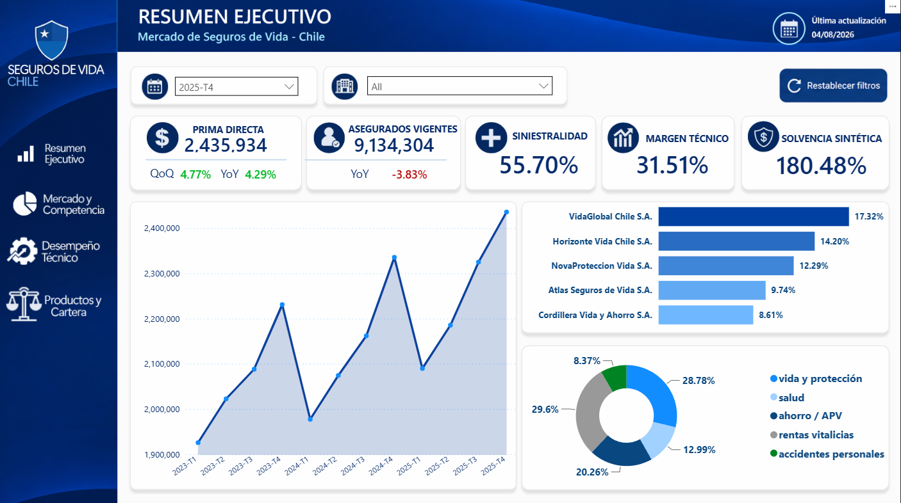
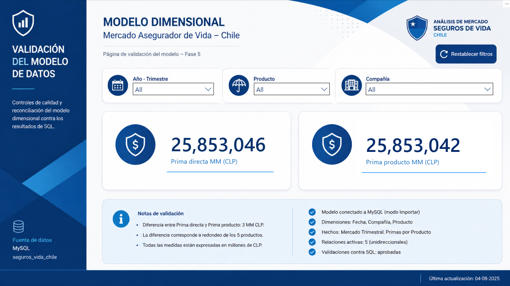
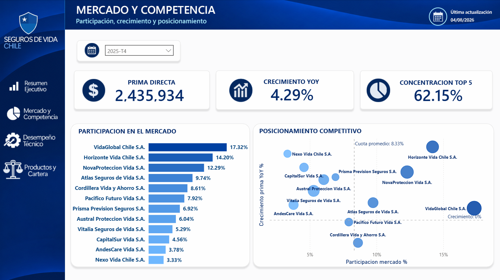
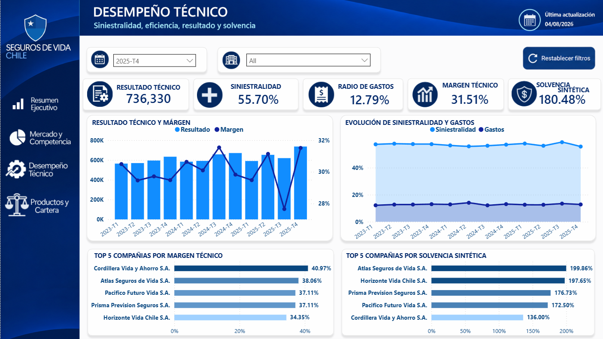
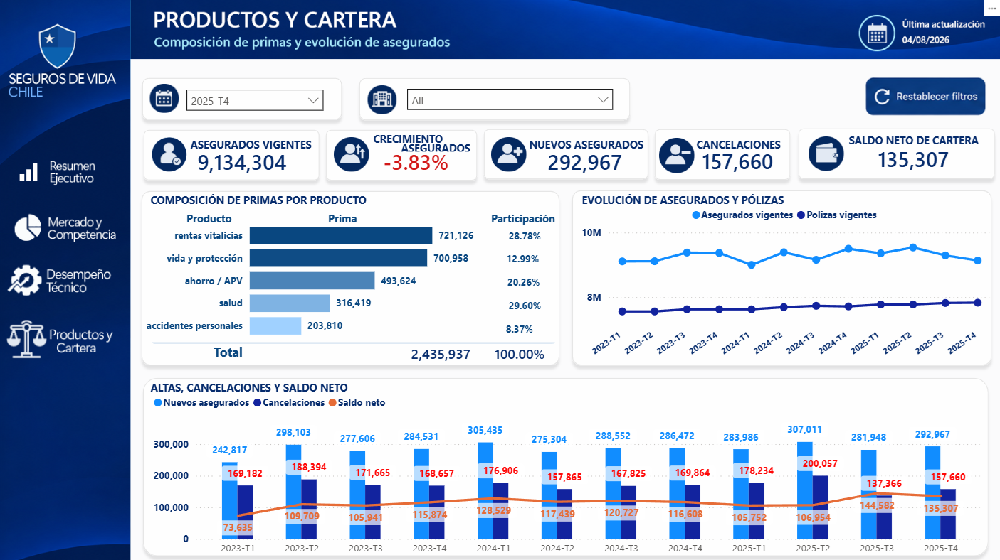

🌐 **[Presentación web del proyecto](https://juanignaciopal.github.io/analisis-mercado-seguros-vida-chile/)**
# 🛡️ Análisis del Mercado Chileno de Seguros de Vida

> 📊 Proyecto end-to-end de Business Intelligence con datos 100 % sintéticos, inspirado en conceptos e indicadores del mercado asegurador chileno.

## English Summary

Data analytics portfolio project examining the Chilean life insurance market using public CMF data. The project covers data validation, SQL analysis, KPI development and interactive Power BI reporting, with a focus on market performance, competition and technical insurance indicators.

Tools: SQL · Excel · Power BI · Power Query · DAX

Full documentation is available below in Spanish.

---

**Estado:** ✅ Proyecto finalizado 
**Período analizado:** 2023-T1 a 2025-T4  
**Compañías:** 12 aseguradoras ficticias  
**Dataset:** 144 observaciones trimestrales · 39 variables originales  
**Stack:** Excel · Power Query · MySQL · SQL · Power BI · DAX · GitHub · Markdown

---

## 📊 Dashboard ejecutivo

[

El dashboard permite analizar **crecimiento, participación de mercado, competencia, desempeño técnico, solvencia sintética, productos y evolución de cartera** dentro del escenario ficticio.

➡️ [Abrir dashboard ejecutivo `.pbix`](Power%20BI/dashboard_ejecutivo_seguros_vida_chile.pbix) · 📄 [Ver hallazgos y recomendaciones](documentacion/hallazgos_y_recomendaciones.md)

---

## 🎯 Caso de negocio

El proyecto simula una necesidad de **Estrategia, Business Intelligence o Analítica** dentro de una compañía multinacional de seguros de vida: monitorear un mercado competitivo, validar indicadores y transformar los resultados en información útil para la toma de decisiones.

### Preguntas clave

- ¿Cómo evoluciona el tamaño del mercado y qué compañías crecen con mayor rapidez?
- ¿Qué aseguradoras lideran en participación y cuáles ganan o pierden posición?
- ¿Cómo se comparan siniestralidad, gastos, margen técnico y solvencia sintética?
- ¿Qué productos explican el crecimiento de las primas?
- ¿Cómo evoluciona la base de asegurados y pólizas?

➡️ [Ver definición completa, stakeholders, 10 preguntas e hipótesis](definicion_proyecto.md)

---

## 🗃️ Dataset

El dataset contiene información trimestral sintética de 12 compañías ficticias de seguros de vida entre 2023-T1 y 2025-T4.

| Característica          |                Valor |
| ----------------------- | -------------------: |
| Observaciones           |              **144** |
| Compañías               |               **12** |
| Períodos                |    **12 trimestres** |
| Variables originales    |               **39** |
| Naturaleza de los datos | **100 % sintéticos** |

Incluye variables financieras, comerciales, operacionales, de capital, cartera y composición de productos.

📄 [Ver dataset original](datos/raw/mercado_asegurador_vida_chile_sintetico.csv) · 📘 [Diccionario de datos](documentacion/diccionario_datos.md)

---

## 🔎 Hallazgos principales

- 📈 La prima directa del mercado sintético aumentó **26,50 %** entre 2023-T1 y 2025-T4. Las caídas QoQ observadas en T1 muestran por qué la tendencia debe contrastarse también con YoY.
- 🥇 **VidaGlobal** mantuvo el liderazgo con **17,32 %** de participación en 2025-T4, pero la brecha frente a **Horizonte** se redujo de **4,38 pp a 3,12 pp** durante el último año.
- 🏢 La concentración del **Top 5** se mantuvo estable alrededor de **61–63 %**; la dinámica competitiva provino principalmente de redistribuciones de participación dentro del grupo líder.
- 👥 En 2025-T4 la prima directa creció **4,29 % YoY**, mientras los asegurados vigentes disminuyeron **3,83 %**, una divergencia que requiere mayor granularidad para explicar su origen.
- 📦 **Vida y Protección + Rentas Vitalicias** explicaron aproximadamente **69,72 %** del aumento absoluto de primas por producto entre 2024-T4 y 2025-T4, dentro de un mix relativamente estable.

> Estos resultados describen exclusivamente el **escenario sintético del proyecto** y no representan el desempeño real del mercado asegurador chileno.

---

## 🎯 Recomendaciones ejecutivas

1. **Crear una watchlist competitiva** que combine participación, crecimiento YoY y variación de market share.
2. **Investigar la divergencia primas–asegurados** incorporando prima promedio, renovación, persistencia y trazabilidad cliente/póliza en un entorno real.
3. **Evaluar eficiencia técnica y fortaleza de capital por separado**, evitando un score único con ponderaciones arbitrarias.
4. **Profundizar los motores de crecimiento de Vida y Protección y Rentas Vitalicias**, que concentran la mayor parte del aumento absoluto observado.
5. **Implementar conciliaciones stock–flujo de cartera** antes de utilizar altas y cancelaciones como base para métricas de churn, retención o persistencia.

📄 [Consultar análisis completo y recomendaciones](documentacion/hallazgos_y_recomendaciones.md)

---

## 🧩 Solución analítica

```text
CSV / Excel
    ↓
Power Query — auditoría y preparación
    ↓
MySQL — almacenamiento y validación
    ↓
SQL — análisis, crecimiento, rankings y controles
    ↓
Power BI — modelo dimensional tipo estrella
    ↓
DAX — KPIs e inteligencia temporal
    ↓
Dashboard ejecutivo
    ↓
Hallazgos y recomendaciones
```

| Capa                 | Implementación                                               |
| -------------------- | ------------------------------------------------------------ |
| **Calidad**          | Auditoría de 144 registros y 39 variables; control de nulos, duplicados, consistencia y plausibilidad |
| **SQL**              | Creación de base, validaciones, análisis de mercado, QoQ, YoY, rankings y controles KPI |
| **KPIs**             | 12 indicadores principales con reglas de agregación y valores de referencia |
| **Power BI**         | Modelo estrella con 3 dimensiones, 2 hechos y 5 relaciones activas 1:* |
| **DAX**              | 29 medidas explícitas: base, KPIs derivados, inteligencia temporal y competencia |
| **Dashboard**        | 4 páginas ejecutivas + página técnica de validación          |
| **Cierre analítico** | Hallazgos, contraste de hipótesis, recomendaciones y limitaciones documentadas |

➡️ [Revisar scripts SQL](sql/) · [Revisar archivos y documentación de Power BI](Power%20BI/)

---

## ✅ Validación y controles

SQL se utilizó como capa de control antes de construir la visualización. Para **2025-T4** se validaron, entre otros:

| Indicador                  |     Valor de control |
| -------------------------- | -------------------: |
| Prima directa              | **2.435.934 MM CLP** |
| Crecimiento QoQ            |           **4,77 %** |
| Crecimiento YoY            |           **4,29 %** |
| Siniestralidad ponderada   |          **55,70 %** |
| Ratio de gastos            |          **12,79 %** |
| Resultado técnico          |   **736.330 MM CLP** |
| Margen técnico             |          **31,51 %** |
| Solvencia sintética        |         **180,48 %** |
| Asegurados vigentes        |        **9.134.304** |
| Crecimiento YoY asegurados |          **-3,83 %** |

📘 [Diccionario de KPIs](documentacion/diccionario_kpis.md) · 📄 [Metodología SQL](documentacion/metodologia_sql.md)

---

## 🧱 Modelo dimensional en Power BI

El modelo analítico transforma la estructura tabular original en un esquema estrella preparado para análisis de mercado y producto.

### Dimensiones

- `D_Fecha` — calendario diario con **1.096 registros** entre 2023-01-01 y 2025-12-31.
- `D_Compania` — **12 aseguradoras ficticias** y sus atributos descriptivos.
- `D_Producto` — **5 categorías** de productos de seguros de vida.

### Tablas de hechos

- `H_Mercado_Trimestral` — **144 registros**, granularidad compañía–trimestre.
- `H_Primas_Producto` — **720 registros**, granularidad compañía–trimestre–producto.

La separación en dos tablas de hechos permite analizar primas por producto sin duplicar métricas como siniestros, gastos, capital, patrimonio o asegurados.

Se configuraron **cinco relaciones activas 1:\*** con filtrado unidireccional desde dimensiones hacia hechos.

### Reconciliación principal — 2025-T4

| Control                |            Resultado |
| ---------------------- | -------------------: |
| Prima directa          | **2.435.934 MM CLP** |
| Prima por producto     | **2.435.937 MM CLP** |
| Diferencia de redondeo |         **3 MM CLP** |

La diferencia corresponde al redondeo de las primas sintéticas distribuidas entre los productos y se mantiene documentada, sin corrección artificial.

[](https://github.com/user-attachments/assets/92daa5f1-a666-44ee-9a20-32f2051bdc6f)

➡️ [Abrir modelo analítico `.pbix`](Power%20BI/modelo_analitico_seguros_vida_chile.pbix)

---

## Páginas del dashboard

| Resumen Ejecutivo                                            | Mercado y Competencia                                        |
| ------------------------------------------------------------ | ------------------------------------------------------------ |
| [](https://github.com/user-attachments/assets/c7f8671e-7e81-4999-b195-7c400ab00b18) | [](https://github.com/user-attachments/assets/831add63-40d3-4394-a3d9-d3691d924bc4) |
| **Desempeño Técnico**                                        | **Productos y Cartera**                                      |
| [](https://github.com/user-attachments/assets/8e990bac-30ce-4f89-869c-bdfc62ebf307) | [](https://github.com/user-attachments/assets/00bcf0c9-f6b9-4098-b3dc-d7abf444b902) |


### Resumen Ejecutivo

Visión consolidada de primas, crecimiento, asegurados, siniestralidad, margen, solvencia, liderazgo y mix de productos.

### Mercado y Competencia

Ranking de las 12 compañías ficticias, concentración Top 5 y posicionamiento por participación, crecimiento y escala.

### Desempeño Técnico

Seguimiento de siniestralidad, gastos, resultado técnico, margen y solvencia sintética, junto con benchmarks entre compañías.

### Productos y Cartera

Composición de primas por producto, evolución de asegurados y pólizas, altas, cancelaciones y saldo neto de cartera.

➡️ [Abrir dashboard ejecutivo `.pbix`](Power%20BI/dashboard_ejecutivo_seguros_vida_chile.pbix) · 📐 [Medidas DAX](Power%20BI/medidas_dax.md) · 🎨 [Diseño del dashboard](Power%20BI/dise%C3%B1o_dashboard_ejecutivo.md)

---

## 🧪 Evidencia técnica del proceso

<details>
<summary><strong>📌 Calidad de datos</strong></summary>


<br>

La auditoría inicial confirmó:

- **144 registros** validados.
- **39 variables** documentadas.
- **0 duplicados**.
- **0 valores nulos**.
- Consistencia de fechas, períodos, compañías y tipos de datos.
- Diferencias menores de redondeo documentadas.
- Identificación de una **limitación de plausibilidad del ROE**, que quedó fuera de los KPIs principales.
- Durante el análisis posterior se documentó además una **limitación de conciliación stock–flujo de cartera**.

📄 [Auditoría de calidad de datos](documentacion/auditoria_calidad_datos.md) · 📘 [Diccionario de datos](documentacion/diccionario_datos.md)

</details>

<details>
<summary><strong>🗄️ SQL y catálogo de KPIs</strong></summary>


<br>

La capa SQL incluyó:

- creación de base de datos y tabla principal;
- clave primaria compuesta e índices;
- validación de carga;
- análisis descriptivo del mercado;
- crecimiento QoQ y YoY;
- rankings y participación;
- validación de KPIs antes de Power BI.

Entre los resultados acumulados del período **2023-T1 a 2025-T4**, Pacífico Futuro Vida presentó el mayor margen técnico acumulado (**39,73 %**). Este resultado no debe confundirse con los rankings específicos de 2025-T4 utilizados posteriormente en Power BI.

Los 12 KPIs principales fueron documentados según fórmula, unidad, interpretación y regla de agregación.

📄 [Metodología SQL](documentacion/metodologia_sql.md) · 📂 [Scripts SQL](sql/) · 📘 [Diccionario de KPIs](documentacion/diccionario_kpis.md)

</details>

<details>
<summary><strong>📐 Power BI y DAX</strong></summary>


<br>

Sobre el modelo validado se construyeron **29 medidas DAX explícitas**:

- 15 medidas base;
- 6 KPIs derivados;
- 6 medidas de inteligencia temporal;
- 2 medidas de apoyo competitivo.

Los ratios fueron recalculados desde sus componentes para evitar promediar porcentajes almacenados. Pólizas, asegurados y capital se trataron como **stocks de cierre**.

📐 [Medidas DAX y metodología](Power%20BI/medidas_dax.md) · 🎨 [Diseño del dashboard](Power%20BI/dise%C3%B1o_dashboard_ejecutivo.md)

</details>

---

## ⚠️ Limitaciones metodológicas

- Los datos y compañías son **100 % sintéticos** y se utilizan únicamente con fines educativos y de portfolio.
- El **ROE** se excluyó de las conclusiones principales por una **limitación de plausibilidad** del dataset sintético.
- La **solvencia sintética** es un indicador educativo y **no reproduce la metodología regulatoria oficial de la CMF**.
- `Saldo Neto Cartera = Nuevos Asegurados - Cancelaciones`, pero esos flujos **no concilian completamente con la variación del stock de asegurados**; por ello no se interpretan como churn, retención o persistencia.
- La prima directa y la suma de primas por producto presentan diferencias menores de redondeo propias de la construcción sintética.
- Las relaciones entre siniestralidad, gastos y margen técnico son parcialmente mecánicas por la fórmula utilizada para construir el resultado técnico.

📄 [Auditoría de calidad de datos](documentacion/auditoria_calidad_datos.md)

---

## 🧭 Cómo explorar el proyecto

| Si quieres revisar...    | Empieza aquí                                                 |
| ------------------------ | ------------------------------------------------------------ |
| **Resultado visual**     | [Dashboard ejecutivo](Power%20BI/dashboard_ejecutivo_seguros_vida_chile.pbix) |
| **Demos del dashboard**  | [Galería de páginas](#%EF%B8%8F-p%C3%A1ginas-del-dashboard)  |
| **Hallazgos de negocio** | [Hallazgos y recomendaciones](documentacion/hallazgos_y_recomendaciones.md) |
| **SQL y controles**      | [Carpeta SQL](sql/)                                          |
| **Definición de KPIs**   | [Diccionario de KPIs](documentacion/diccionario_kpis.md)     |
| **Modelo Power BI**      | [Modelo analítico](Power%20BI/modelo_analitico_seguros_vida_chile.pbix) |
| **Calidad del dato**     | [Auditoría de calidad](documentacion/auditoria_calidad_datos.md) |
| **Dataset**              | [CSV sintético](datos/raw/mercado_asegurador_vida_chile_sintetico.csv) |
| **Caso de negocio**      | [Definición del proyecto](definicion_proyecto.md)            |

---

<details>
<summary><strong>🧭 Metodología del proyecto — 8 fases</strong></summary>


<br>

1. ✅ **Definición del problema de negocio** — stakeholders, preguntas e hipótesis.
2. ✅ **Auditoría y limpieza** — calidad, consistencia y diccionario de datos.
3. ✅ **SQL** — preparación, análisis de mercado, crecimiento y rankings.
4. ✅ **KPIs** — catálogo formal, reglas de agregación y valores de control.
5. ✅ **Modelo Power BI** — esquema estrella, relaciones y validación.
6. ✅ **Dashboard ejecutivo** — DAX, cuatro páginas e interacciones.
7. ✅ **Hallazgos y recomendaciones** — interpretación, contraste de hipótesis y priorización ejecutiva.
8. ✅ **Documentación y publicación final** — QA, presentación y cierre del portfolio.

</details>

---

<details>
<summary><strong>🗂️ Estructura principal del repositorio</strong></summary>


<br>

```text
analisis-mercado-seguros-vida-chile/
│
├── README.md
├── definicion_proyecto.md
│
├── datos/
│   └── raw/
│       └── mercado_asegurador_vida_chile_sintetico.csv
│
├── documentacion/
│   ├── auditoria_calidad_datos.md
│   ├── diccionario_datos.md
│   ├── diccionario_kpis.md
│   ├── metodologia_sql.md
│   └── hallazgos_y_recomendaciones.md
│
├── imagenes/
│   ├── modelo_analitico_preview.png
│   ├── modelo_dimensional_powerbi.png
│   ├── validacion_kpis_preview.png
│   ├── dashboard_resumen_ejecutivo_preview.png
│   ├── dashboard_mercado_competencia_preview.png
│   ├── dashboard_desempeno_tecnico_preview.png
│   └── dashboard_productos_cartera_preview.png
│
├── power_query/
│   └── mercado_asegurador_vida_raw.pq
│
├── sql/
│   ├── README.md
│   └── [scripts SQL validados]
│
└── Power BI/
    ├── README.md
    ├── modelo_analitico_seguros_vida_chile.pbix
    ├── dashboard_ejecutivo_seguros_vida_chile.pbix
    ├── medidas_dax.md
    └── diseño_dashboard_ejecutivo.md
    
```

</details>

---

## 📚 Alcance del proyecto

Este repositorio demuestra un flujo completo de Business Intelligence:

**problema de negocio → calidad de datos → SQL → KPIs → modelo dimensional → DAX → dashboard → hallazgos → recomendaciones**.

El objetivo no es reproducir estadísticas oficiales del mercado chileno, sino demostrar cómo abordar un caso analítico de seguros con una metodología trazable, controles explícitos y comunicación orientada a negocio.


