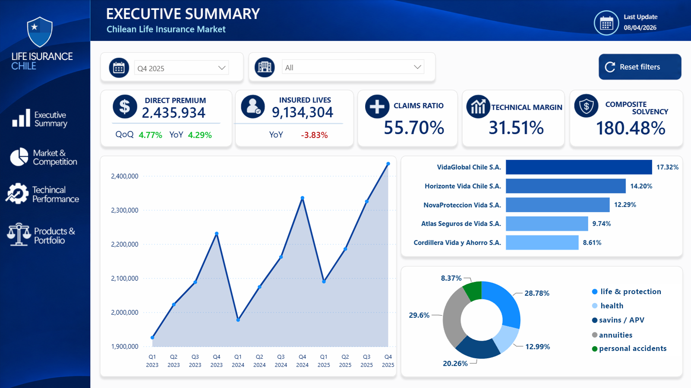
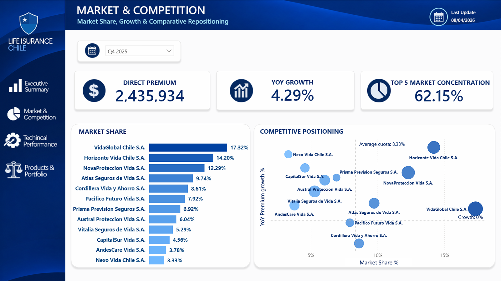
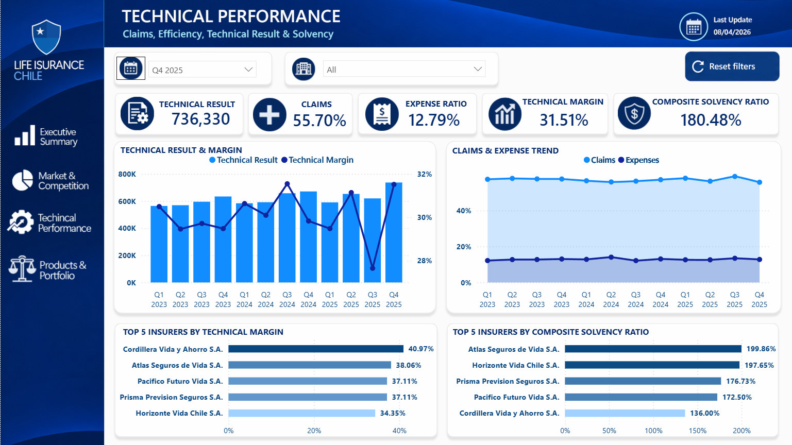
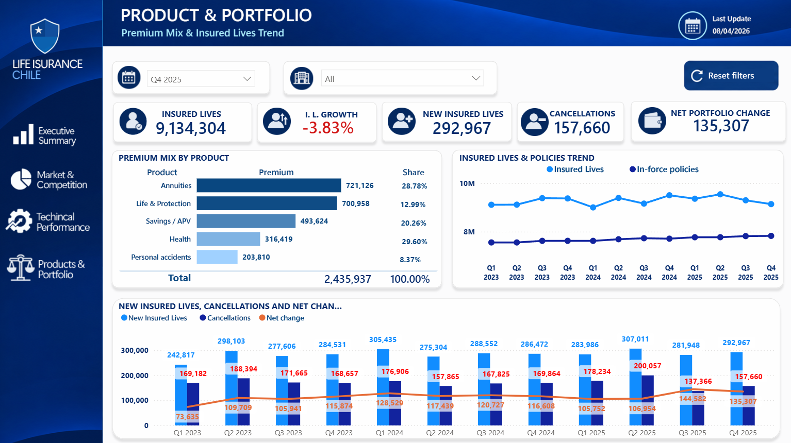

# Chilean Insurance Market Analysis | CMF

> 📊 **End-to-end Data Analytics project focused on the Chilean insurance market using using a synthetic dataset inspired by concepts, indicators, and reporting practices from the Chilean insurance market and CMF regulatory context.**

[Spanish version](README.md)

---

## 📌 Project Overview

This project analyzes the **evolution, competitive structure, and performance of the Chilean insurance market** using official regulatory data published by the **Comisión para el Mercado Financiero (CMF)**.

The main objective was to transform raw regulatory information into a structured analytical solution capable of answering relevant business questions related to:

- 📈 Market growth and evolution over time
- 🏢 Competitive positioning among insurance companies
- 💰 Premium distribution and market concentration
- 🔍 Performance differences across insurance segments
- 📊 Changes in market participation between reporting periods

Rather than focusing only on visualization, the project covers the **complete analytical workflow**, from data preparation and validation to SQL analysis, KPI development, data modeling, and business-oriented visualization.

The final result is an interactive **Power BI dashboard** designed to communicate market information clearly and support data-driven interpretation.

---

## 🎯 Project Objective

The project was developed to simulate a realistic Data Analyst workflow within a regulated financial industry.

Its purpose is to demonstrate the ability to:

- Transform raw regulatory data into analysis-ready datasets
- Detect and validate potential data-quality issues
- Use SQL to explore, validate, and analyze market information
- Define business-oriented KPIs
- Build a structured analytical data model
- Develop interactive dashboards for non-technical stakeholders
- Translate analytical results into clear business insights

---

## ❓ Business Questions

The analysis was designed around questions such as:

- Which insurance companies hold the largest share of the Chilean market?
- How has premium volume evolved across reporting periods?
- How concentrated is the market among the leading insurers?
- Which insurance segments show the strongest market participation?
- How does competitive positioning change over time?
- Which companies gain or lose market share between periods?

These questions guided the analytical process from the SQL layer to the final dashboard.

---

## 🛠️ Tech Stack

| Tool | Application |
|---|---|
| 📗 **Microsoft Excel** | Initial data inspection, preparation, and validation |
| 🗄️ **MySQL / SQL** | Data-quality validation, market analysis, and KPI verification |
| 📊 **Power BI** | Data modeling, DAX measures, visualization, and interactive dashboard development |
| 🧮 **DAX** | KPI calculations, time intelligence, and analytical measures |
| 🐙 **GitHub** | Version control, documentation, and project presentation |

---

## 🔄 Analytical Workflow

The project follows an end-to-end analytical process:

**Raw CMF Data**  
⬇️  
**Data Preparation & Validation**  
⬇️  
**SQL Analysis**  
⬇️  
**KPI Definition & Verification**  
⬇️  
**Data Modeling**  
⬇️  
**Power BI Dashboard**  
⬇️  
**Business Insights & Documentation**

---

## 📊 Dashboard Preview

The final Power BI report is structured into four analytical pages, each designed to answer a different set of business questions about the Chilean life insurance market.

### 🧭 1. Executive Summary

Provides a high-level view of the market through key indicators such as **Direct Premium, Insured Lives, Claims Ratio, Technical Margin, and Composite Solvency Ratio**.

It also summarizes premium trends, leading insurers, and the distribution of the product portfolio.



---

### 🏢 2. Market & Competition

Focuses on the competitive structure of the insurance market, including **market share, year-over-year growth, and concentration among the largest insurers**.

This page is designed to identify market leaders and changes in competitive positioning over time.



---

### ⚙️ 3. Technical Performance

Evaluates insurers through technical indicators including **Claims Ratio, Expense Ratio, Technical Result, Technical Margin, and Composite Solvency Ratio**.

The page helps compare operational performance and identify insurers with stronger technical results.



---

### 📦 4. Products & Portfolio

Analyzes the composition of insurance premiums by product while tracking changes in **Insured Lives, In-force Policies, New Insured Lives, Cancellations, and Net Portfolio Change**.

This page provides a portfolio-level view of how the market evolves across different insurance products.



---
---

## 🗃️ Data & Project Scope

This project uses a **100% synthetic dataset** created exclusively for educational and portfolio purposes.

The dataset is inspired by the structure, terminology, and analytical indicators commonly used in the Chilean life insurance market and its regulatory environment.

> ⚠️ **Important:** The companies and observations used in this project are fictitious and do not represent the actual performance of insurers operating in Chile.

### Dataset Overview

| Attribute | Description |
|---|---|
| 🏢 Insurance companies | 12 fictitious life insurers |
| 📅 Period analyzed | Q1 2023 – Q4 2025 |
| 📊 Quarterly observations | 144 |
| 🧾 Original variables | 39 |
| 📦 Product categories | 5 |
| 🗓️ Reporting frequency | Quarterly |

The dataset includes financial, commercial, operational, portfolio, and solvency-related variables used to simulate a realistic Business Intelligence case in the life insurance industry.

---

## 🏗️ Analytical Architecture

The project follows an end-to-end analytical workflow in which each layer serves a specific purpose.

```text
Synthetic Insurance Dataset
            │
            ▼
     Data Quality Audit
     Excel / Power Query
            │
            ▼
       MySQL Database
            │
            ▼
 SQL Analysis & Validation
            │
            ▼
      KPI Definition
     12 Core Indicators
            │
            ▼
   Power BI Data Model
      Star Schema
            │
            ▼
       DAX Measures
   Business Logic Layer
            │
            ▼
 Executive Power BI Dashboard
            │
            ▼
 Business Insights & Recommendations

``` 
---
## 🧱 Dimensional Model

The Power BI semantic model was designed using a **star schema**, separating descriptive dimensions from transactional and analytical fact tables.

The model contains:

- `D_Fecha` — calendar dimension covering the complete analytical period. (Power BI, DAX)
- `D_Compania` — dimension containing the 12 fictitious life insurance companies included in the analysis. (Power BI)
- `D_Producto` — dimension containing the five insurance product categories. (Power BI)
- `H_Mercado_Trimestral` — quarterly fact table containing market, financial, portfolio, claims, expense, and solvency indicators by insurer. (Power BI)
- `H_Primas_Producto` — fact table containing premium distribution by insurer, quarter, and insurance product. (Power BI)

The product-level premium table was intentionally separated from the main quarterly fact table to avoid duplicating non-additive measures such as claims, expenses, capital, equity, and insured lives. (Power BI)

The model uses active **one-to-many relationships**, with single-direction filtering from dimensions toward fact tables, providing a simple and controlled structure for analytical reporting. (Power BI)
---

## 💼 What This Project Demonstrates

This project is not only an insurance-market dashboard.

It is also meant to demonstrate a broader set of transferable Data Analytics capabilities:

- 🧹 **Data preparation and quality control**
- 🗄️ **SQL-based analytical reasoning**
- 📐 **Data modeling**
- 📊 **Business Intelligence development**
- 📈 **KPI design and validation**
- 🧠 **Business-oriented interpretation**
- 📝 **Technical documentation**
- 🌎 **Communication of a local business case for an international audience**
