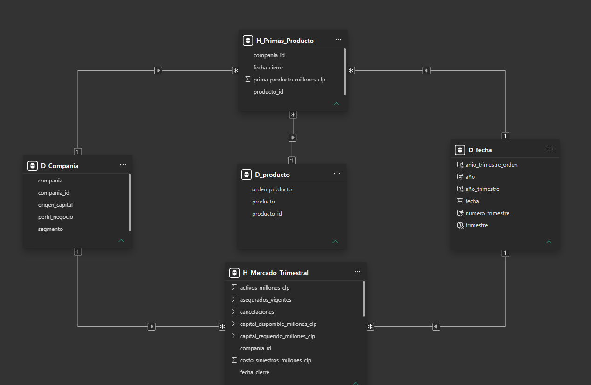

# 🧱 Modelo dimensional de Power BI — Fase 5

## Objetivo

Construir un modelo semántico en esquema estrella para analizar el mercado sintético de seguros de vida sin mezclar mediciones con granularidades diferentes.

## Fuente

- **Motor:** MySQL 8.0
- **Base de datos:** `seguros_vida_chile`
- **Tabla fuente:** `mercado_asegurador_vida`
- **Modo de almacenamiento:** Importar
- **Granularidad de la fuente:** una compañía ficticia por trimestre

## Arquitectura implementada



El modelo contiene tres dimensiones y dos tablas de hechos:

- `D_Fecha`
- `D_Compania`
- `D_Producto`
- `H_Mercado_Trimestral`
- `H_Primas_Producto`

## Granularidades

### `H_Mercado_Trimestral`

Una fila representa:

```text
1 compañía ficticia + 1 trimestre
```

**Resultado validado:** 144 filas y 21 columnas.

Incluye hechos financieros, operacionales y de cartera:

- primas totales;
- siniestros y gastos;
- resultados;
- reservas y balance;
- capital;
- pólizas y asegurados.

No incluye las cinco primas por producto ni los ratios precalculados que se reconstruirán posteriormente como medidas.

### `H_Primas_Producto`

Una fila representa:

```text
1 compañía ficticia + 1 trimestre + 1 producto
```

**Resultado validado:** 720 filas y 4 columnas.

Contiene:

- `fecha_cierre`
- `compania_id`
- `producto_id`
- `prima_producto_millones_clp`

## Dimensiones

### `D_Compania`

**Filas:** 12  
**Clave:** `compania_id`

Atributos:

- compañía;
- origen del capital;
- segmento;
- perfil de negocio.

### `D_Producto`

**Filas:** 5  
**Clave:** `producto_id`

Categorías:

- Vida y Protección;
- Salud;
- Ahorro / APV;
- Rentas Vitalicias;
- Accidentes Personales.

### `D_Fecha`

Dimensión diaria continua entre 2023-01-01 y 2025-12-31.

**Filas:** 1.096  
**Clave:** `fecha`

Atributos:

- año;
- número de trimestre;
- trimestre;
- año-trimestre;
- columna de orden.

La tabla fue marcada como tabla de fechas y `año_trimestre` fue ordenado mediante su columna de orden.

## Relaciones

| Dimensión | Tabla de hechos | Cardinalidad | Dirección | Estado |
|---|---|---|---|---|
| `D_Fecha[fecha]` | `H_Mercado_Trimestral[fecha_cierre]` | 1:* | Única | Activa |
| `D_Compania[compania_id]` | `H_Mercado_Trimestral[compania_id]` | 1:* | Única | Activa |
| `D_Fecha[fecha]` | `H_Primas_Producto[fecha_cierre]` | 1:* | Única | Activa |
| `D_Compania[compania_id]` | `H_Primas_Producto[compania_id]` | 1:* | Única | Activa |
| `D_Producto[producto_id]` | `H_Primas_Producto[producto_id]` | 1:* | Única | Activa |

No existe una relación directa entre las dos tablas de hechos.

## Justificación de las dos tablas de hechos

Las métricas generales se encuentran a nivel compañía-trimestre, mientras que las primas por producto se encuentran a nivel compañía-trimestre-producto.

Incorporar el producto directamente en la tabla de mercado implicaría repetir siniestros, gastos, capital y asegurados cinco veces. La separación evita ese doble conteo y mantiene un grano consistente en cada tabla.

## Configuración aplicada

- Claves técnicas ocultas en la vista de informe.
- Identificadores y columnas de orden configurados como **No resumir**.
- Montos y conteos configurados como números enteros con separador de miles.
- Relaciones bidireccionales y muchos a muchos evitadas.
- Consulta de staging con carga deshabilitada.

## Alcance

La Fase 5 construye y valida el modelo.

Las medidas DAX empresariales, el diseño visual y el dashboard ejecutivo corresponden a la Fase 6.
